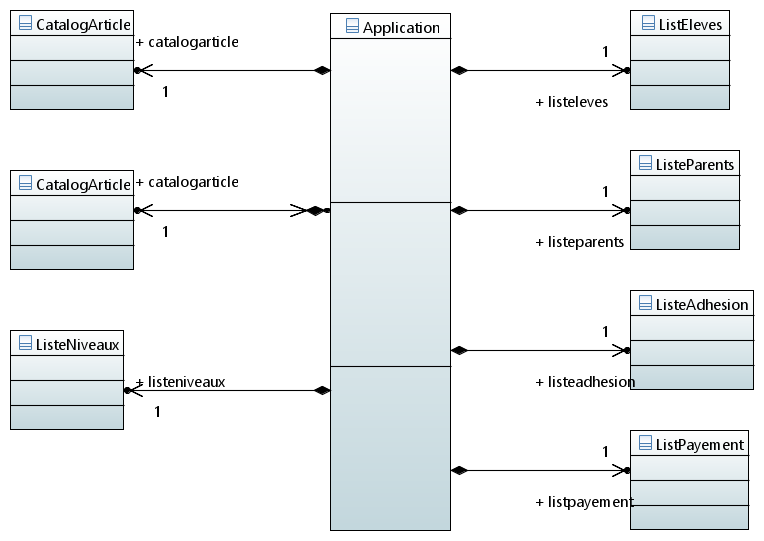
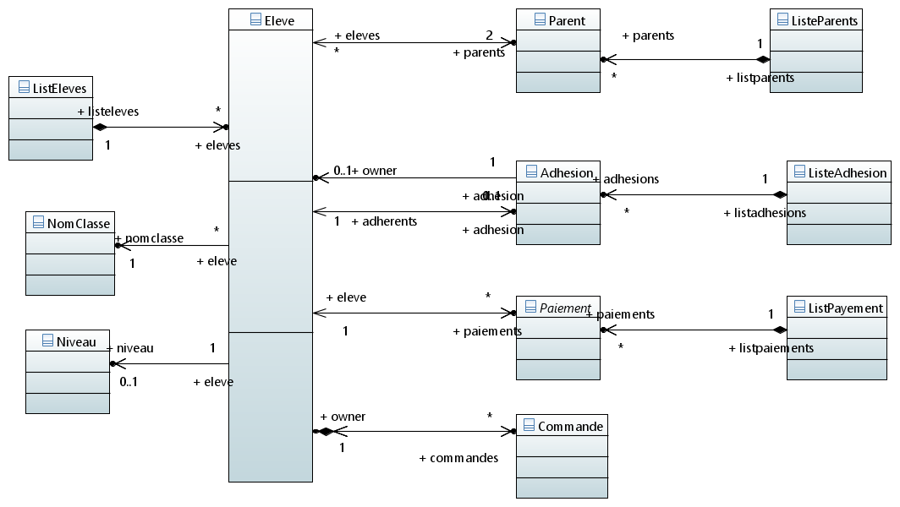
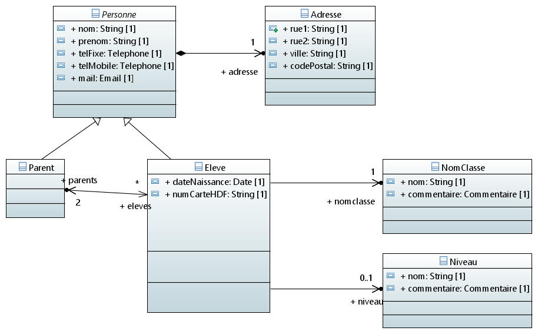
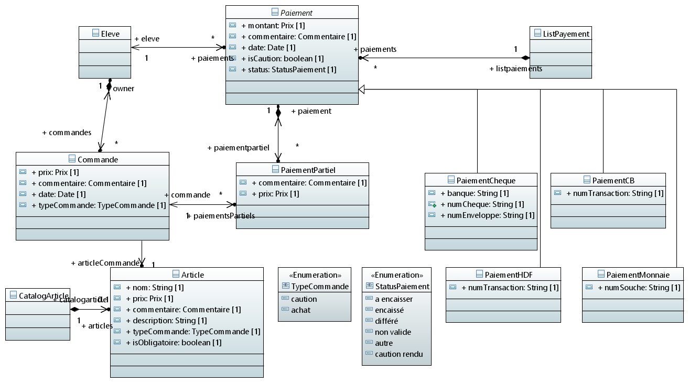
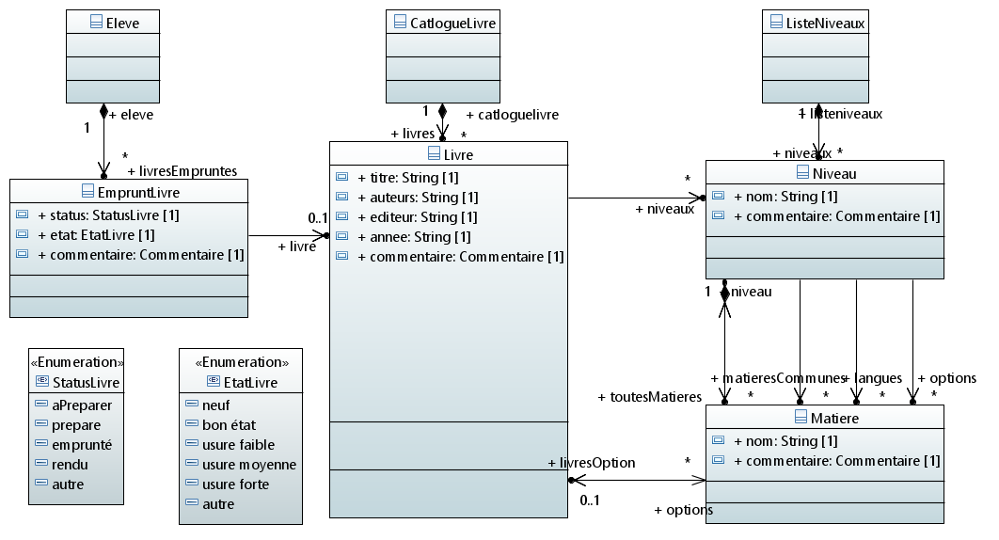
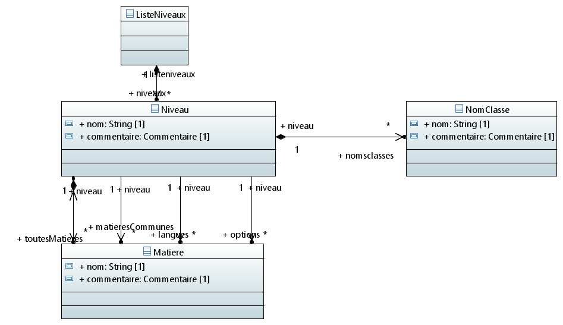

# Diagrammes de classes

Ce document présente une solution possible pour les classes de l'application BAL.

## Application

### Classe Application
Cette classe est la classe racine de l'application. Elle permet d'accéder à toutes les structures mises à disposition par l'application.

La classe application detient un ensemble de listes (listeXxx ou CatalogXxx) vers les différentes entités de l'application.

## Eleves, Parents et Personnes

**Eleves**

**Relations entre Personnes, Parent et Eleve**

### Classe Eleve
La classe Eleve contient les informations sur un Eleve.

### Properties
* **parent[2]** - Les parents de l'éléve
* **adhesion** - L'adhesion associée à l'éléve. L'adhésion peut être partagée entre plusieurs membre d'une même famille.
* **paiments** - Les paiements effectué par l'éléve
* **commandes** - LEs commandes effectués par l'éléve.
* **niveau** - Le niveau dans lequel est l'éléve. Ceci est une référence vers le niveau.
* **nomClasse** - Référence vers le nom de la classe.

### Classe Personne
Ancetre commun à Parent et Eleve.

### Classe Parent
Représente un parent d"éléve.

## Commandes et paiements

**Commandes et paiements**

### Classe Paiement
**Abstract**
Cette classe représente un paiement effectué pour un éléve.
Il existe plusieurs type de paiements :
* cheque
* carte HDF
* carte bancaire (pas dans actuellement)
* monnaie
* autre (a ajouter au diagramme)

Un paiement correspond à un paiement effectué. Par exemple, pour un cheque il y aura un objet paiement. Si l'éléve fournit plusieurs chéques, il y aura un objet paiement pour chacun des cheques.

Un paiement peut servir à payer différentes **Commande**. On mémorise, dans des  **PaiementPartiel** chaque commande payée à l'aide de ce Paiement. Une commande peut être payé partielement par plusieurs paiement. **PaiementPartiel** memorise la fraction de somme utilisée pour payer la commande.

### Classe Commande
Une commande effectuée par l'éléve.
Une commande représente l'achat effectif d'un article : calculatrice, clé usb, normographe, adhésion, location livre, caution livre.

Un éléve peut avoir plusieurs objets **Commande**, chacun representant un article acheté.

Lors de la création d'un éléve, on lui ajoute systématiquement les  commandes suivants (correspondant aux articles 'obligatoire') : adhésion, location livre, caution livre.

### Classe Article
Un article pouvant être acheté par les éléves.

Les articles peuvent être : calculatrice, clé usb, normographe, adhésion, location livre, caution livre.

Il y a deux type d'articles :
* les articles - représente quelque chose qui est achetable (calculatrice ...)
* les cautions - représente une caution que doit verser l'éléve (caution des livres). Les  cautions sont rendus à la fin de l'année, ou encaissées.

Par défaut, l'application ne contient pas d'article. L'administrateur doit définir les articles lors de la première utilisation.

Lors de la création d'un éléve, une commande est ajouté pour chaque articles 'obligatoire'.

## Livres

**Livres**

### Classe Livre
La classe Livre représente un titre de livre empruntable par les éléves.

L'administrateur doit définir les livres lors de la première utilisation de l'application, ou par la suite.
Un livre connait le ou les niveaux pour lesquels il est destiné, ainsi que la ou les matières qui l'utilisent.

Les livres sont détenus par **CatalogueLivre**.
Une matière référence les livres qu'elle utilise.

 
## Niveau

### Classe Niveau
La classe Niveau permet de définir un niveau dans un établissement : Seconde, première, terrminale ...

Par défaut, l'application ne définit pas les niveaux. L'administrateur devra définir les niveaux et leurs noms lors de la premiere utilisation. Il devra aussi définir les matieres, et les noms de classes.

A un niveau est associé une liste des noms de classes existantes pour ce niveau. Le nom du niveau et le nom de classe permettent d'obtenir le nom complet de la classe (1ere1, 2nd3 ...).

A un niveau est associé les Matieres enseignées à ce niveaux. On distingue les Matieres **commune**, les **langues** et les **options**.

#### Properties

* **nomsClasses** - Liste des noms de classes associées à  ce niveau.
* **toutesMatieres** - Liste contenant toutes les matieres du niveau.
* **matieresCommunes** - Sous-liste de **toutesMatieres**. Reference les matieres communes.
* **langues** - Sous-liste de **toutesMatieres**. Reference les langues.
* **options** - Sous-liste de **toutesMatieres**. Reference les options.

### Classe NomClasse
Cette classe définie le nom d'une classe (1, 2, 3...). Elle permet, avec le niveau, d'avoir le nom complet (1ere1, 2nd3 ...)

Par défaut, l'application ne définit pas les noms. L'administrateur devra définir les noms de classes lors de la première utilisation.

### Classe Matiere
Cette classe permet de definir les matières (Français, Math, Histoire ...) enseignées dans un niveau.
A chaque matière est associé un ou plusieurs livres utilisés par la matière.
